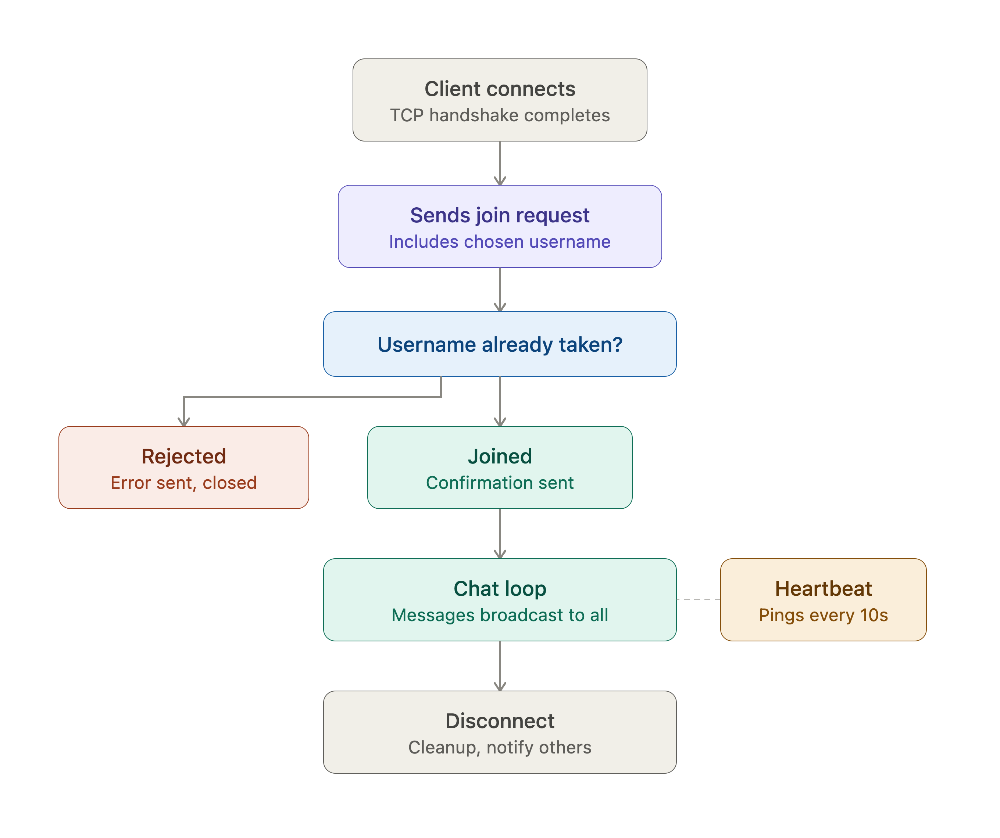
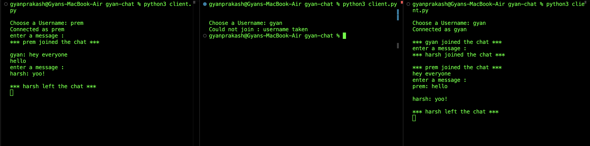
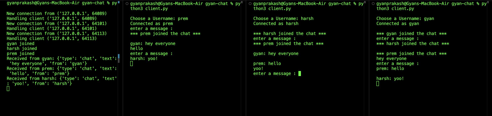
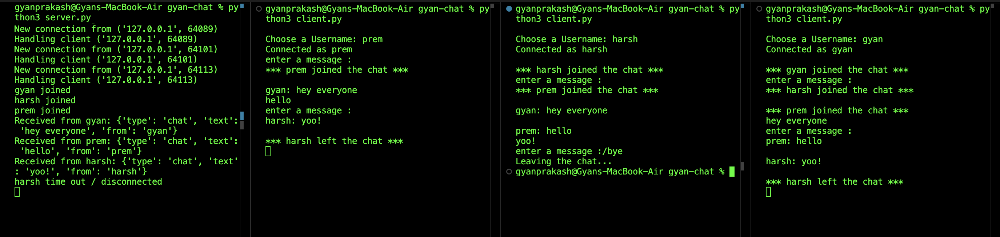

# gyan-chat 

A real-time group chat app that runs in your terminal — built completely from scratch using raw network sockets. No chat libraries, no WebSocket frameworks. I designed my own rules for how messages travel between computers, and then built a server and client that follow those rules.

I built this to actually understand what's happening underneath apps like Discord or WhatsApp, instead of just importing a library that does the hard part for me.

---

## File structure

```
gyan-chat/
├── server.py       # accepts connections, manages clients, broadcasts messages, runs the heartbeat
├── client.py       # connects to the server, handles the join process, sends/receives messages
├── protocol.py     # shared rules for packaging and unpacking messages (used by both server and client)
├── demo/           # screenshots showing the app running (see below)
├── tests/          # reserved for future automated tests
├── .gitignore
└── README.md       # this file
```

`protocol.py` is shared between the server and client on purpose — both sides need to agree on the exact same rules for reading and writing messages, so keeping that logic in one place means there's no chance of the two sides quietly drifting out of sync with each other.

---

---

## What it actually does

You run the server on one machine. Then anyone on the same network can run the client, pick a username, and start chatting with everyone else who's connected — live, in real time, right in the terminal. If someone's connection drops (even if their laptop crashes or their WiFi dies), the server notices within seconds and lets everyone know they left.

---


## How it works, at a glance

<p align="center">
  
</p>

This diagram shows the complete journey of a client—from connecting to the server and choosing a username, to sending messages, responding to heartbeat checks, and finally disconnecting. The sections below explain each part of this workflow in more detail.


---

## Features — explained simply

Below are the technical building blocks of this project, explained in plain English so you don't need a networking background to follow along.

### Custom message protocol
**TCP** (Transmission Control Protocol) is what actually moves data between two computers reliably — but it only guarantees your bytes arrive in order, not that they arrive as neat, separate "messages." So I designed my own rules on top of TCP for how a message should be structured, sent, and understood — basically a mini language that my server and client both speak.

### Message framing
Because TCP just sends a continuous stream of bytes with no built-in concept of "this is one message, this is the next," I had to solve that myself. Every message I send is preceded by a small number telling the receiver exactly how many bytes to expect. This way, the receiving side always knows exactly where one message ends and the next begins — even if the network splits or bundles the data unpredictably.

### JSON-based messages
**JSON** (JavaScript Object Notation) is just a simple, readable text format for structured data — like a labeled box instead of a random ball of text. Every message in this app is a small JSON object with a `type` (what kind of message it is) and whatever details go with it. This makes it easy for both sides to understand exactly what a message means and what to do with it.

### Handshake (joining the chat)
Before anyone can start chatting, they have to "introduce themselves" — the client sends the server their chosen username first. The server checks if that name is already taken by someone else currently in the chat. If it is, the person gets a polite rejection instead of just being let in and causing confusion. If it's free, they're officially welcomed in, and everyone else gets notified.


*A second client trying to join as `gyan` while `gyan` is already connected gets rejected immediately, instead of two people silently sharing one identity.*

### 📢 Broadcasting
Once someone sends a message, the server doesn't just keep it to itself — it immediately forwards that message out to every other person currently connected, so everyone sees the conversation happen live, together.


*Four terminals — one server, three clients (`gyan`, `harsh`, `prem`) — all seeing each other's messages and join announcements in real time.*

### Multi-client support (threading)
Since multiple people need to be able to type and read messages at the exact same time, the server gives each connected person their own dedicated "thread" — basically a lightweight, independent worker that only pays attention to that one person, so nobody has to wait in line for their turn.

### Thread-safe shared data (locking)
Since all these independent workers (threads) need to look at and update the same shared list of "who's currently online," there's a real risk of two of them accidentally colliding and corrupting that list at the same time. To prevent this, I used a **lock** — think of it as a "one person in the room at a time" rule — so only one thread can update that shared list at any given moment, keeping everything consistent and crash-free.

### Heartbeat (detecting dead connections)
Here's a problem: if someone's laptop just dies or their WiFi drops without warning, TCP doesn't always tell the server right away — the connection can just sit there looking "alive" when it's actually gone. To catch this, the server periodically sends a tiny "are you still there?" (`ping`) message to every client, and expects a quick "yes" (`pong`) back. If someone goes quiet for too long without replying, the server assumes they've disconnected, cleans them up, and lets everyone else know — all automatically, without needing anyone to send a real chat message first.

### Crash-proof disconnect handling
When someone force-quits their app or their connection drops abruptly, trying to read from their now-broken connection can actually throw an error and crash the server if you're not careful. I specifically handled this so a single person disconnecting messily never takes down the whole chat for everyone else.

### Tested over a real local network
Beyond just running everything on one laptop, I also tested the server accepting connections through my machine's actual network address (not just the "talking to myself" `localhost` shortcut) — confirming it's genuinely ready to work across separate devices on the same WiFi.

### Clean exit with `/bye`
Instead of having to force-quit your terminal to leave the chat, typing `/bye` closes your connection on purpose, in a controlled way. This means the server notices immediately (not after a heartbeat timeout) and announces your departure right away, with no error messages or ugly tracebacks on either side.


*`harsh` leaves the chat, and the server and remaining clients are notified right away.*

---

## How to run it

You just need Python 3 installed — no extra installs, everything used is part of Python's standard library.

**1. Start the server:**
```bash
python3 server.py
```

**2. In a separate terminal (or on another device on the same WiFi), start a client:**
```bash
python3 client.py
```

Pick a username when prompted, and start chatting. Open multiple client terminals to simulate a group chat.

**To leave the chat:** type `/bye` instead of a message, and hit enter. This closes your connection cleanly and lets the server (and everyone else) know you've left immediately — no need to force-quit your terminal.

**To connect from a different device on the same WiFi:** set `HOST` in `server.py` to `0.0.0.0` (this means "accept connections from anyone on the network," not just yourself), find your server machine's local network address, and use that address as `HOST` in `client.py` on the other device.

---

## How to test it yourself

You don't need a second laptop to try this out — everything below works with just one machine and a few terminal windows.

### Test 1: Basic group chat (3 terminals)

1. Open a terminal and start the server:
   ```bash
   python3 server.py
   ```
   You should see `Server listening on 0.0.0.0:65432`.

2. Open a second terminal and start a client:
   ```bash
   python3 client.py
   ```
   Enter a username, e.g. `alice`.

3. Open a third terminal and start another client the same way, with a different username, e.g. `bob`.

4. Type a message in alice's terminal and hit enter — it should immediately appear in bob's terminal (and vice versa). Both should also see a `*** alice joined the chat ***` style message when the other joins.

### Test 2: Duplicate username rejection

1. With `alice` still connected from Test 1, open a fourth terminal and try:
   ```bash
   python3 client.py
   ```
   and enter `alice` again as the username.

2. It should immediately print something like `Could not join: username taken` and exit — confirming the server correctly rejects duplicate names instead of letting two people share one identity.

### Test 3: Clean exit with `/bye`

1. With a couple of clients connected and chatting, type `/bye` in one of them instead of a regular message.

2. That client should print `Leaving the chat...` and exit immediately, with no error output.

3. Check the **server terminal** — it should print that user as disconnected right away (not after a delay), and the remaining client(s) should see a "left the chat" announcement almost instantly.

### Test 4: Disconnect detection (heartbeat)

1. With two clients connected and chatting, close one client's terminal window abruptly (or press `Ctrl+C`) instead of quitting normally.

2. Watch the **server terminal**. Within about 25–35 seconds, it should print something like `alice timed out / disconnected` on its own — without anyone needing to send another message first. This confirms the heartbeat is actively checking for dead connections, not just reacting when it happens to notice.

### Test 5: Testing over a real network (not just one laptop)

If you want to confirm this works across separate devices, not just within one machine:

1. Make sure `HOST` in `server.py` is set to `0.0.0.0` (this means "accept connections from any device on the network," not just yourself).

2. On the server machine, find its local network address. On macOS:
   ```bash
   ipconfig getifaddr en0
   ```
   This prints something like `192.168.x.x`.

3. On the connecting device (a second laptop on the same WiFi, or the same laptop for a quick check), set `HOST` in `client.py` to that address instead of `127.0.0.1`, then run the client as usual.

4. If it connects and joins successfully, the server is genuinely reachable over the network — not just from itself.

---

## How a message actually travels, start to finish

1. You type a message and hit enter
2. The client wraps it into a small JSON object and measures how many bytes it is
3. It sends that length first, then the actual message — this is the framing step
4. The server reads the length, then reads exactly that many bytes to get your full message
5. The server stamps your username onto the message and sends it out to everyone else currently connected
6. Each other client's "listening" thread picks it up and prints it on their screen

All of this happens in a fraction of a second, but each of those steps was something I had to explicitly design and build — nothing came for free.

---

## Bugs I ran into (and what they taught me)

Building this wasn't a straight line — here are a few real problems I hit and had to actually debug:

- **A thread that silently never ran**: I wrote `thread.start` instead of `thread.start()` — missing those parentheses meant Python just referenced the function without ever calling it. No error, no warning — it just quietly didn't work, which was a good lesson in how silent bugs can be sneakier than loud crashes.
- **Cleanup running at the wrong time**: early on, I accidentally placed my "remove this person from the chat" logic *inside* the message-receiving loop instead of after it — so people were getting removed right after their very first message. Moving that cleanup to run exactly once, only when someone actually disconnects, fixed it.
- **A real crash from an abrupt disconnect**: when someone force-quits their client, trying to read from their now-dead connection can throw an actual error instead of just quietly telling you "they're gone." I had to specifically catch and handle that error so one messy disconnect never crashes the whole server for everyone else.
- **Ctrl+C behaves differently than closing a terminal**: I discovered that killing a client with Ctrl+C doesn't always get detected by the server as quickly as fully closing its terminal window — which is exactly the real-world gap the heartbeat feature is meant to close. No matter *how* someone disappears, the heartbeat guarantees they'll be detected within a short, predictable window.

---

## Known limitations (being honest about what's not perfect)

- **Messages can visually overlap with your typing** in the terminal — since incoming messages and your own typing happen independently, a new message can occasionally land mid-line while you're mid-sentence. This is a real limitation of plain terminal output, not a bug in the actual chat logic — a proper fix would need a more advanced terminal interface library that keeps your typing and the chat history in separate areas of the screen.
- **No chat history is saved** — once you close the client, that conversation is gone.
- **No encryption** — messages travel as plain, readable text, which is fine for a local learning project but wouldn't be safe for anything sensitive.
- **Mostly tested on one machine so far** (including over its real network address, not just talking to itself) — the design is ready for separate physical devices, but that specific test is still pending.

---

<p align="center">
  <sub>Built by <a href="https://github.com/gyan-prakash-007">Gyan Prakash</a> — one socket, one bug, and one lesson at a time.</sub>
</p>
